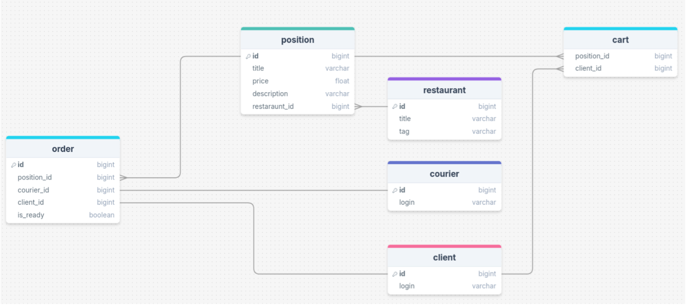

# Техническое задание

## Приложение для доставки еды - "HungryStudent"

Аналог - Яндекс Еда.*

---

## Основные функциональные роли

- **Клиент** (заказчик еды)
- **Ресторан** (шаурмичная)
- **Курьер** (мистер схожу-заберу-принесу)

---

## Общий функционал для всех ролей

- Регистрация - добавление нового пользователя/ресторана/курьера
- Авторизация

---

## Возможности клиента

- Получить список ближайших ресторанов  
  (в случае реализации клиентской части будут отображаться на карте)
- Получить список ресторанов по поисковому запросу  
  (искать как по названию, так и по тегам к заведениям, например: “роллы”, “пицца”)
- Получить список позиций в конкретном заведении
- Добавлять/удалять позиции из корзины
- Оформить заказ

> Так как у нас MVP, то заказы будем хранить просто в отдельной таблице в БД.

---

## Возможности заведения

- Получить список всех позиций
- Добавить/удалить позицию
- Получить список текущих заказов
- Приготовить заказ  
  (в рамках учебного проекта процесс “мгновенный” без промежуточных этапов и разветвлений. В теории, это бы расширилось до минимум трёх действий: взять заказ/отменить заказ, сообщить о готовности заказа)

---

## Возможности курьера

Курьер является промежуточным звеном между клиентом и заведением. Он сможет:

- Получить список приготовленных задач
- Забрать приготовленный заказ
- Отдать заказ клиенту

> В реальной жизни реализация данных действий являлась бы нелегкой задачей, так что в нашем случае все действия курьер делает мгновенно и не будет включать в себя сложную логику (как распределение заказов между курьерами, отслеживание курьера и т.д.).

---

## Итоговый бизнес-процесс

1. Клиент ищет заведение
2. Выбирает позиции, формируя корзину
3. Делает заказ
4. Заведение принимает заказ и выполняет его
5. Курьер получает новый готовый заказ
6. Курьер забирает заказ
7. Курьер отдает заказ клиенту

---

## Нефункциональные требования

- Время отклика API не должно превышать 300 мс.
- Масштабируемость для работы с большим количеством пользователей.
- Аутентификация пользователей через JWT.
- Ограничение доступа к данным пользователей.

---

## Архитектура системы

### Структура приложения

- **Контроллер**: обрабатывает HTTP-запросы, взаимодействует с сервисом и возвращает JSON.
- **Сервис**: реализует бизнес-логику (управление данными).
- **Репозиторий**: отвечает за работу с базой данных (CRUD-операции).

---

## Используемые технологии

- Язык программирования: **Kotlin**
- База данных: **PostgreSQL**
- Документация API: **OpenAPI**
- Фреймворк: **Spring**
- Unit-тестирование: **JUnit** и **Mockito**
- Контейнеризация: **Docker**

---

## SQL-Схема

### Основные БД сущности

- **Client** - клиент, хранит в себе айди и логин
- **Courier** - курьер, хранит в себе айди и логин
- **Restaraunt** - заведение, хранит в себе айди, логин, название и тэг (для поиска)
- **Position** - позиция заведения, хранит в себе айди, название, цену, описание и внешний ключ на ресторан  
  (несколько позиций на один ресторан = связь 1:N)
- **Cart** - корзина, таблица для связи сущностей Position+Client, реализует связь N:N
- **Order** - заказ, хранит в себе состояние всего заказа: его позиции, клиент, готов ли заказ и курьер (если есть)

---

## Развёртывание

- Контейнеризация - приложение и БД развёртываются в Docker-контейнерах с помощью Docker compose

---

## Оценка рисков

- Невозможность обеспечения заявленной производительности при высоких нагрузках
- Уязвимости в реализации аутентификации и авторизации
- Возможные сложности с масштабированием базы данных

---
 

